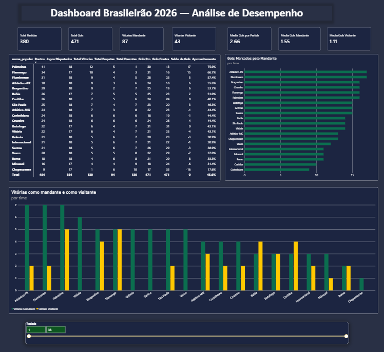
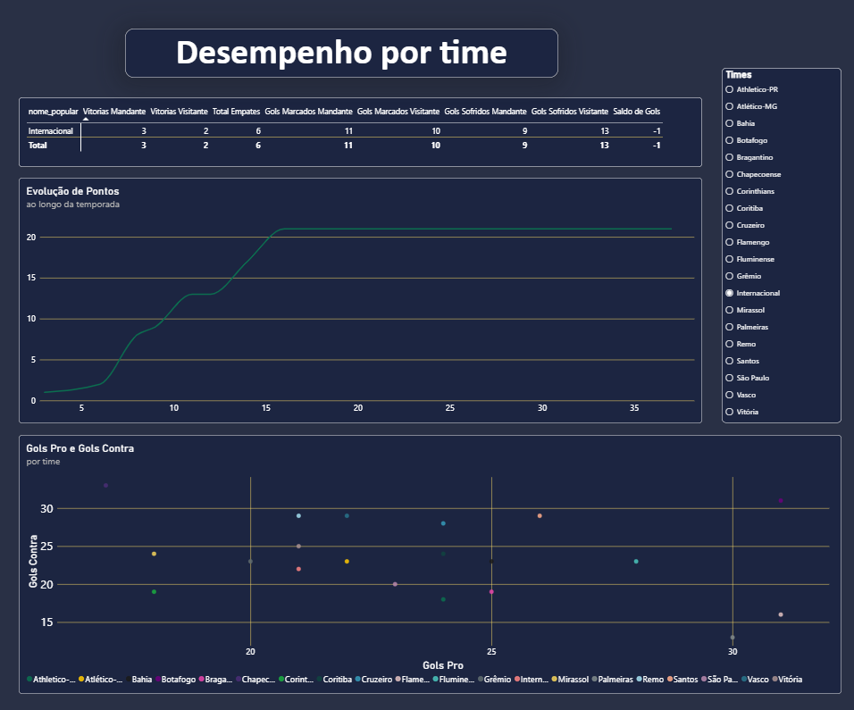
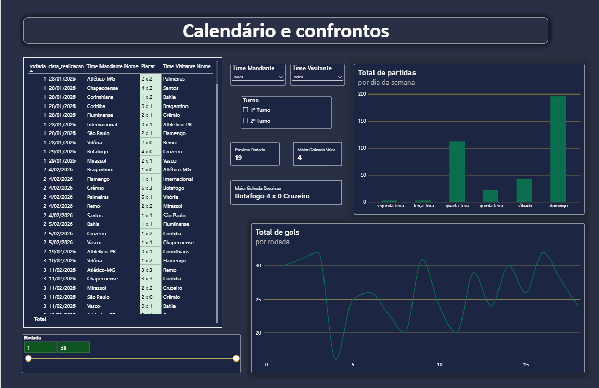

# ⚽ Análise e Previsão de Resultados — Brasileirão 2026

Pipeline completo de dados esportivos: da extração via API pública até um dashboard interativo e um modelo de Machine Learning servido por uma API própria.

Projeto desenvolvido como parte da formação em Ciência de Dados e Machine Learning (UniCEUB), com foco em aplicar, na prática, um fluxo de dados de ponta a ponta — não apenas uma análise isolada.

---

## 🎯 Visão geral

```
API pública (api-futebol.com.br)
        │
        ▼
  Extração (Python)
        │
        ▼
  Banco de dados MySQL
        │
        ▼
  Tratamento e Feature Engineering (Pandas)
        │
   ┌────┴─────┐
   ▼          ▼
Modelo de ML   Dashboard (Power BI)
   │           - Visão Geral
   ▼           - Desempenho por Time
API própria    - Calendário e Confrontos
(FastAPI)
   │
   ▼
Automação (Make) — dispara a atualização dos dados
```

---

## 📊 O problema

O Campeonato Brasileiro Série A 2026 está em andamento. O objetivo do projeto foi construir uma solução que:

1. Coletasse dados reais de partidas, times e resultados de forma automatizada
2. Armazenasse esses dados de forma estruturada e consultável
3. Analisasse padrões de desempenho (aproveitamento, saldo de gols, fator casa)
4. Estimasse a probabilidade de resultado de uma partida com base na forma recente dos times
5. Apresentasse tudo isso de forma visual e interativa

---

## 🗂️ Estrutura do repositório

```
futebol-analytics/
├── data/
│   ├── raw/            # JSON bruto da API (não versionado)
│   └── processed/      # dataset tratado, pronto para ML
├── src/
│   ├── extract.py      # extração de dados via API
│   └── load_db.py      # carga dos dados no MySQL
├── notebooks/
│   └── analise_exploratoria.ipynb   # EDA, feature engineering, treino do modelo
├── api/
│   ├── main.py              # API FastAPI (previsão + atualização de dados)
│   └── modelo_resultado.pkl # modelo treinado, serializado
├── dashboard/
│   └── dashboard_futebol.pbix   # dashboard Power BI (3 páginas)
├── requirements.txt
└── README.md
```

---

## 🔧 Tecnologias utilizadas

| Categoria | Ferramentas |
|---|---|
| Linguagem | Python 3.14 |
| Extração de dados | `requests`, API pública (api-futebol.com.br) |
| Banco de dados | MySQL, `mysql-connector-python`, SQLAlchemy |
| Análise de dados | Pandas, Jupyter Notebook |
| Visualização (EDA) | Matplotlib, Seaborn |
| Machine Learning | scikit-learn (Regressão Logística, Random Forest) |
| API | FastAPI, Uvicorn |
| Dashboard / BI | Power BI (Power Query, DAX, modelagem em estrela) |
| Automação | Make (agendamento + chamada HTTP) |
| Versionamento | Git, GitHub |

---

## 1️⃣ Extração de dados

Script (`src/extract.py`) que percorre as 38 rodadas do Campeonato Brasileiro via API pública, com tratamento de erros e pausa entre requisições para não sobrecarregar o serviço. Os dados brutos são salvos em JSON.

## 2️⃣ Banco de dados

Modelagem relacional em MySQL com duas tabelas principais (`times` e `partidas`), usando chave estrangeira para garantir integridade referencial. A carga usa `ON DUPLICATE KEY UPDATE`, permitindo reprocessar os dados sem gerar duplicidade — importante porque placares de partidas futuras são atualizados conforme os jogos acontecem.

## 3️⃣ Tratamento e Feature Engineering

No notebook (`notebooks/analise_exploratoria.ipynb`):

- Análise exploratória: distribuição de resultados, fator casa, distribuição de gols por partida
- Criação de features de **forma recente** (média móvel de pontos e gols dos últimos 5 jogos de cada time), calculadas com `.shift(1)` para **evitar vazamento de dados** (a partida atual nunca entra no cálculo da própria previsão)
- Dataset final salvo em `data/processed/dataset_modelo.csv`

## 4️⃣ Machine Learning

Dois modelos foram treinados e comparados para prever o resultado de uma partida (vitória do mandante / empate / vitória do visitante):

| Modelo | Acurácia | Recall (vitória visitante) |
|---|---|---|
| Regressão Logística | 64,7% | 0,00 |
| Random Forest | 47,1% | 0,00 |

**A Regressão Logística foi o modelo escolhido**, por ter desempenho geral superior e ser mais simples de interpretar. Ambos os modelos tiveram dificuldade em prever vitórias do time visitante (classe minoritária nos dados) — uma limitação real, provavelmente relacionada ao volume ainda reduzido de partidas disponíveis (temporada em andamento). Essa limitação está documentada diretamente no notebook, junto com a comparação entre os modelos.

## 5️⃣ API própria

Construída com FastAPI (`api/main.py`), com três endpoints:

- `GET /` — verificação de status
- `POST /prever` — recebe os IDs de dois times e retorna a previsão do modelo, com as probabilidades de cada resultado (calculadas em tempo real, buscando a forma recente de cada time direto no MySQL)
- `POST /atualizar-dados` — dispara a atualização do pipeline (extração + carga no banco), pensado para ser acionado pela automação

## 6️⃣ Dashboard (Power BI)

Três páginas, com modelagem em **esquema estrela** (tabela-calendário separada, tratamento no Power Query, colunas calculadas em DAX):

**Visão Geral** — tabela de classificação completa (pontos, saldo de gols, aproveitamento), KPIs de gols totais e médias, ranking de ataque, comparação de vitórias mandante vs. visitante.





**Desempenho por Time** — tabela detalhada por time, gráfico de evolução de pontos acumulados ao longo da temporada (filtrável por time), gráfico de dispersão (gols marcados vs. sofridos) para leitura tática do campeonato.

**Calendário e Confrontos** — tabela de todos os confrontos com formatação condicional (jogos finalizados vs. agendados), cartões dinâmicos ("próxima rodada", "maior goleada da temporada"), distribuição de jogos por dia da semana.

> ⚠️ Para abrir o dashboard, é necessário ter o MySQL rodando localmente com os dados carregados (o arquivo `.pbix` não armazena a conexão nem os dados, apenas a estrutura do relatório).

## 7️⃣ Automação (Make)

Cenário configurado no Make com um módulo HTTP (`POST /atualizar-dados`) e agendamento diário, demonstrando como o pipeline de extração e carga poderia ser disparado automaticamente, sem intervenção manual.

**Limitação assumida:** como a API roda localmente (não hospedada na nuvem), essa automação, na configuração atual, funciona plenamente apenas quando o computador e a API estão ativos no horário agendado. Em uma versão de produção, a API estaria hospedada em um serviço como Render ou Railway, permitindo execução realmente independente do computador do desenvolvedor.

---

## 📈 Principais aprendizados

- **Vazamento de dados (data leakage)** é um risco real e sutil em features baseadas em séries temporais — resolvido com `.shift(1)` antes de qualquer agregação
- Modelos mais complexos (Random Forest) não são sempre melhores, especialmente com datasets pequenos — a comparação honesta entre modelos vale mais do que perseguir o modelo mais sofisticado
- Modelagem correta em Power BI (relações ativas/inativas, `USERELATIONSHIP`) é essencial quando uma mesma tabela se conecta a outra por mais de um caminho (mandante/visitante)
- Dados do mundo real têm particularidades (jogos adiados, ausência de horário exato) que exigem tratamento cuidadoso e transparência sobre as limitações

---

## 🚀 Como executar o projeto

```bash
# Clonar o repositório
git clone https://github.com/vinisoares9/futebol-analytics.git
cd futebol-analytics

# Criar e ativar ambiente virtual
python -m venv venv
venv\Scripts\activate

# Instalar dependências
pip install -r requirements.txt

# Configurar variáveis de ambiente (.env)
# API_FUTEBOL_KEY=sua_chave_aqui
# MYSQL_PASSWORD=sua_senha_aqui

# Extrair e carregar os dados
python src/extract.py
python src/load_db.py

# Rodar a API
uvicorn api.main:app --reload
# Acesse http://127.0.0.1:8000/docs
```

O notebook de análise (`notebooks/analise_exploratoria.ipynb`) e o dashboard (`dashboard/dashboard_futebol.pbix`) podem ser abertos independentemente, desde que o banco de dados já esteja populado.

---

## 👤 Autor

**Vinícius Ribeiro Soares**
Estudante de Ciência de Dados e Machine Learning — UniCEUB
[LinkedIn](https://www.linkedin.com/in/vinícius-soares-b60616352) · [GitHub](https://github.com/vinisoares9)
